# Entity Relationship Diagram

> Software Vala Platform — Database Schema Reference  
> All tables across 6 functional domains

```mermaid
erDiagram
    %% ============================================================
    %% DOMAIN 1: IDENTITY & ACCESS
    %% ============================================================

    tenants {
        uuid id PK
        string name
        string slug
        string plan
        boolean is_active
        jsonb settings
        timestamp created_at
        timestamp updated_at
    }

    users {
        uuid id PK
        uuid tenant_id FK
        string email
        string full_name
        app_role role
        boolean is_active
        string phone
        string avatar_url
        timestamp last_login
        timestamp created_at
    }

    roles {
        uuid id PK
        uuid tenant_id FK
        string name
        string description
        jsonb permissions
        boolean is_system
        timestamp created_at
    }

    permissions {
        uuid id PK
        string resource
        string action
        string description
        boolean is_system
        timestamp created_at
    }

    %% ============================================================
    %% DOMAIN 2: API MANAGEMENT
    %% ============================================================

    api_services {
        uuid id PK
        uuid tenant_id FK
        string name
        string provider
        string base_url
        decimal cost_per_call
        integer rate_limit_rpm
        boolean is_active
        boolean kill_switch
        string kill_switch_reason
        jsonb config
        timestamp created_at
        timestamp updated_at
    }

    api_service_health {
        uuid id PK
        uuid service_id FK
        string status
        integer response_time_ms
        integer uptime_pct
        string error_message
        timestamp checked_at
    }

    provider_integrations {
        uuid id PK
        uuid tenant_id FK
        string provider_name
        string api_key_encrypted
        string endpoint
        boolean is_active
        jsonb metadata
        timestamp created_at
    }

    product_api_mapping {
        uuid id PK
        uuid product_id FK
        uuid service_id FK
        integer priority
        boolean is_active
        timestamp created_at
    }

    role_api_permissions {
        uuid id PK
        uuid role_id FK
        uuid service_id FK
        boolean can_call
        integer daily_limit
        timestamp created_at
    }

    ip_whitelist {
        uuid id PK
        uuid tenant_id FK
        uuid user_id FK
        string ip_address
        string description
        boolean is_active
        timestamp created_at
    }

    region_rules {
        uuid id PK
        uuid tenant_id FK
        string region_code
        boolean is_allowed
        string action
        timestamp created_at
    }

    %% ============================================================
    %% DOMAIN 3: FINANCIAL
    %% ============================================================

    wallets {
        uuid id PK
        uuid tenant_id FK
        decimal balance
        decimal held_amount
        string currency
        boolean is_locked
        string lock_reason
        timestamp created_at
        timestamp updated_at
    }

    wallet_transactions {
        uuid id PK
        uuid wallet_id FK
        uuid tenant_id FK
        string type
        decimal amount
        decimal running_balance
        string reference
        string description
        uuid created_by FK
        timestamp created_at
    }

    wallet_ledger {
        uuid id PK
        uuid wallet_id FK
        uuid tenant_id FK
        string entry_type
        decimal debit
        decimal credit
        decimal balance_after
        string reference_id
        string reference_type
        timestamp created_at
    }

    billing_records {
        uuid id PK
        uuid tenant_id FK
        uuid service_id FK
        uuid user_id FK
        decimal amount
        string currency
        string status
        string description
        jsonb metadata
        timestamp billed_at
        timestamp created_at
    }

    invoices {
        uuid id PK
        uuid tenant_id FK
        string invoice_number
        decimal subtotal
        decimal tax
        decimal total
        string status
        date due_date
        timestamp paid_at
        timestamp created_at
    }

    %% ============================================================
    %% DOMAIN 4: USAGE & ANALYTICS
    %% ============================================================

    api_service_usage {
        uuid id PK
        uuid tenant_id FK
        uuid service_id FK
        uuid user_id FK
        integer call_count
        integer success_count
        integer error_count
        decimal total_cost
        integer total_tokens
        date usage_date
        timestamp created_at
    }

    product_api_usage {
        uuid id PK
        uuid tenant_id FK
        uuid product_id FK
        uuid service_id FK
        integer call_count
        decimal cost
        date usage_date
        timestamp created_at
    }

    role_usage_tracking {
        uuid id PK
        uuid tenant_id FK
        uuid role_id FK
        uuid service_id FK
        integer daily_calls
        integer monthly_calls
        date tracking_date
        timestamp created_at
    }

    cost_tracking {
        uuid id PK
        uuid tenant_id FK
        uuid service_id FK
        decimal daily_cost
        decimal monthly_cost
        decimal projected_cost
        date tracking_date
        timestamp created_at
    }

    latency_metrics {
        uuid id PK
        uuid tenant_id FK
        uuid service_id FK
        integer p50_ms
        integer p95_ms
        integer p99_ms
        integer avg_ms
        integer sample_count
        timestamp recorded_at
    }

    %% ============================================================
    %% DOMAIN 5: OBSERVABILITY & ALERTS
    %% ============================================================

    alert_rules {
        uuid id PK
        uuid tenant_id FK
        string name
        string metric
        string operator
        decimal threshold
        string severity
        boolean is_active
        jsonb notification_config
        timestamp created_at
    }

    alerts {
        uuid id PK
        uuid tenant_id FK
        uuid rule_id FK
        string title
        string message
        string severity
        string status
        jsonb metadata
        timestamp triggered_at
        timestamp resolved_at
    }

    anomaly_logs {
        uuid id PK
        uuid tenant_id FK
        uuid service_id FK
        string anomaly_type
        decimal expected_value
        decimal actual_value
        decimal deviation_pct
        string severity
        timestamp detected_at
    }

    api_failure_logs {
        uuid id PK
        uuid tenant_id FK
        uuid service_id FK
        integer status_code
        string error_type
        string error_message
        integer response_time_ms
        timestamp failed_at
    }

    rate_limit_events {
        uuid id PK
        uuid tenant_id FK
        uuid service_id FK
        uuid user_id FK
        string limit_type
        integer limit_value
        integer current_value
        timestamp event_at
    }

    %% ============================================================
    %% DOMAIN 6: SECURITY & AUDIT
    %% ============================================================

    api_keys {
        uuid id PK
        uuid tenant_id FK
        uuid user_id FK
        string key_hash
        string name
        string[] scopes
        boolean is_active
        timestamp expires_at
        timestamp last_used_at
        timestamp created_at
    }

    api_access_logs {
        uuid id PK
        uuid tenant_id FK
        uuid service_id FK
        uuid api_key_id FK
        string method
        string path
        integer status_code
        integer response_time_ms
        string ip_address
        timestamp accessed_at
    }

    abuse_events {
        uuid id PK
        uuid tenant_id FK
        uuid user_id FK
        string event_type
        string description
        string severity
        string ip_address
        jsonb metadata
        timestamp created_at
    }

    audit_logs {
        uuid id PK
        uuid tenant_id FK
        uuid user_id FK
        string action
        string resource
        string resource_id
        jsonb before_state
        jsonb after_state
        string ip_address
        timestamp created_at
    }

    admin_action_logs {
        uuid id PK
        uuid admin_id FK
        uuid tenant_id FK
        string action_type
        string description
        jsonb payload
        string ip_address
        timestamp created_at
    }

    %% ============================================================
    %% DOMAIN 7: SYSTEM & CONFIG
    %% ============================================================

    system_state {
        uuid id PK
        string key
        jsonb value
        string description
        uuid updated_by FK
        timestamp updated_at
    }

    incident_reports {
        uuid id PK
        uuid tenant_id FK
        string title
        string severity
        string status
        text description
        text resolution
        uuid assigned_to FK
        timestamp started_at
        timestamp resolved_at
        timestamp created_at
    }

    default_limits {
        uuid id PK
        app_role role
        string resource
        integer daily_limit
        integer monthly_limit
        integer rate_limit_rpm
        timestamp created_at
    }

    alert_thresholds {
        uuid id PK
        uuid tenant_id FK
        string metric
        decimal warning_threshold
        decimal critical_threshold
        boolean is_active
        timestamp created_at
    }

    notification_preferences {
        uuid id PK
        uuid tenant_id FK
        uuid user_id FK
        string channel
        string[] event_types
        boolean is_active
        jsonb config
        timestamp created_at
    }

    config_change_logs {
        uuid id PK
        uuid tenant_id FK
        uuid changed_by FK
        string config_key
        jsonb old_value
        jsonb new_value
        string reason
        timestamp changed_at
    }

    %% ============================================================
    %% RELATIONSHIPS
    %% ============================================================

    tenants ||--o{ users                  : "has"
    tenants ||--o{ roles                  : "defines"
    tenants ||--|| wallets                : "owns"
    tenants ||--o{ api_services           : "subscribes to"
    tenants ||--o{ provider_integrations  : "configures"
    tenants ||--o{ billing_records        : "billed"
    tenants ||--o{ invoices               : "invoiced"
    tenants ||--o{ api_service_usage      : "tracks"
    tenants ||--o{ alert_rules            : "sets"
    tenants ||--o{ alerts                 : "receives"
    tenants ||--o{ audit_logs             : "generates"
    tenants ||--o{ api_keys               : "issues"
    tenants ||--o{ ip_whitelist           : "whitelists"
    tenants ||--o{ region_rules           : "restricts"
    tenants ||--o{ incident_reports       : "files"
    tenants ||--o{ config_change_logs     : "changes"

    users ||--o{ audit_logs               : "author"
    users ||--o{ api_keys                 : "holds"
    users ||--o{ wallet_transactions      : "initiates"
    users ||--o{ role_api_permissions     : "granted via"
    users ||--o{ notification_preferences : "configures"

    roles ||--o{ role_api_permissions     : "grants"
    roles ||--o{ role_usage_tracking      : "tracks"
    roles }o--o{ permissions              : "includes"

    wallets ||--o{ wallet_transactions    : "records"
    wallets ||--o{ wallet_ledger          : "double-entries"

    api_services ||--o{ api_service_health   : "monitored by"
    api_services ||--o{ product_api_mapping  : "mapped to"
    api_services ||--o{ role_api_permissions : "accessible via"
    api_services ||--o{ api_service_usage    : "usage"
    api_services ||--o{ billing_records      : "charges"
    api_services ||--o{ api_failure_logs     : "logs failures"
    api_services ||--o{ rate_limit_events    : "rate limited"
    api_services ||--o{ anomaly_logs         : "anomalies"
    api_services ||--o{ latency_metrics      : "latency"
    api_services ||--o{ cost_tracking        : "costs"

    billing_records }o--|| invoices       : "aggregated into"
    alert_rules ||--o{ alerts             : "triggers"
    alerts }o--|| incident_reports        : "escalated to"
    api_keys ||--o{ api_access_logs       : "used in"
```

---

## Domain Summary

| Domain | Tables | Description |
|--------|--------|-------------|
| Identity & Access | `tenants`, `users`, `roles`, `permissions` | Multi-tenant user management and role definitions |
| API Management | `api_services`, `api_service_health`, `provider_integrations`, `product_api_mapping`, `role_api_permissions`, `ip_whitelist`, `region_rules` | API service catalogue, provider keys, access rules |
| Financial | `wallets`, `wallet_transactions`, `wallet_ledger`, `billing_records`, `invoices` | Double-entry ledger, holds, billing and invoicing |
| Usage & Analytics | `api_service_usage`, `product_api_usage`, `role_usage_tracking`, `cost_tracking`, `latency_metrics` | Per-tenant, per-service usage and cost data |
| Observability & Alerts | `alert_rules`, `alerts`, `anomaly_logs`, `api_failure_logs`, `rate_limit_events` | Threshold rules, fired alerts, anomaly detection |
| Security & Audit | `api_keys`, `api_access_logs`, `abuse_events`, `audit_logs`, `admin_action_logs` | Key management, access logs, GDPR audit trail |
| System & Config | `system_state`, `incident_reports`, `default_limits`, `alert_thresholds`, `notification_preferences`, `config_change_logs` | Platform-wide settings, kill switches, defaults |

---

## Key Design Decisions

- **Multi-tenancy**: Every table (except system-level tables) carries a `tenant_id` column enforced via Supabase RLS policies.
- **Double-entry ledger**: `wallet_ledger` uses credit/debit columns ensuring the sum always balances (every transaction has equal and opposite entries).
- **Soft holds**: `wallets.held_amount` reserves funds without reducing the ledger balance, enabling pre-authorisation workflows.
- **Immutable audit trail**: `audit_logs` and `admin_action_logs` are append-only; rows are never updated or deleted.
- **Kill switch**: `api_services.kill_switch` (per-service) and `system_state` key `ai_kill_switch_active` (global) allow emergency shutdown.
